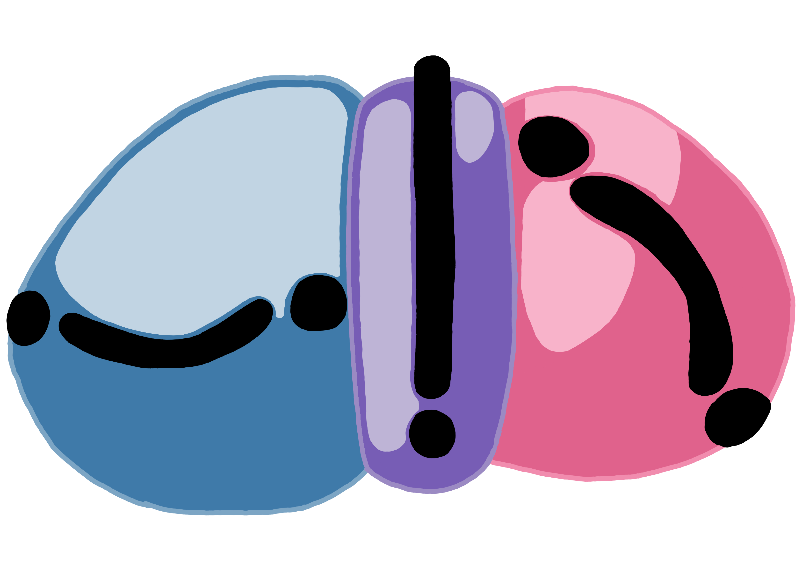

# my-game

## Game Description

my game is a turn-based fighting game inspired by classic Pokémon battles, where you—the main character—battle against four generic monsters: a spider, slime, zombie, and wolf. Each monster comes with unique stats and specialized attack moves. you can use punches, kicks, magical fire spells, and potions strategically to defeat each enemy and win the game

## Background

I created Battle Quest to explore basic game mechanics and develop my skills in JavaScript, HTML, and CSS. I chose the Pokémon-like battle system because it's straightforward, engaging, and allows creative freedom in character and attack design.

## Getting Started

[Play the deployed game here!](https://fork-lift-enthusiast.github.io/my-game/)

### How to Play:

Select your action (Attack, Items, or Run) each turn.

Choose from physical or magical attacks.

Monitor your health and mana, using potions as needed.

Defeat all monsters to win.

### Technologies Used

JavaScript (ES6+)

HTML5

CSS3 

procreate 

## future updates
i need to make it prettier(more animations, backfround, better styling for my buttons)
i wanna make an overworld, shop, boss level 
i want to add speed mechanics to the run option 
i want to make the mechanics more complex ex: armor, enemy bloodlust, differnt flee reactions, etc 
i want to add experience and gold after you win a fight 

